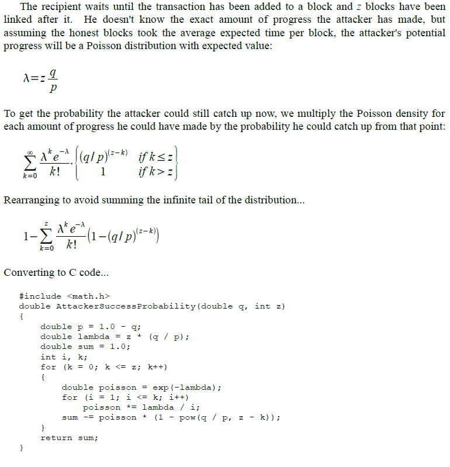
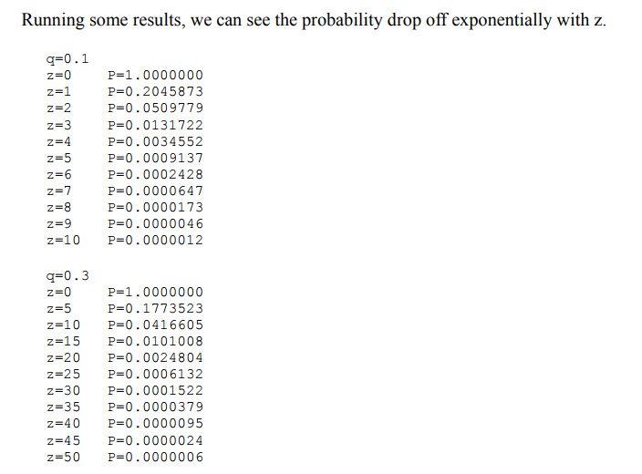
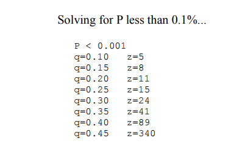
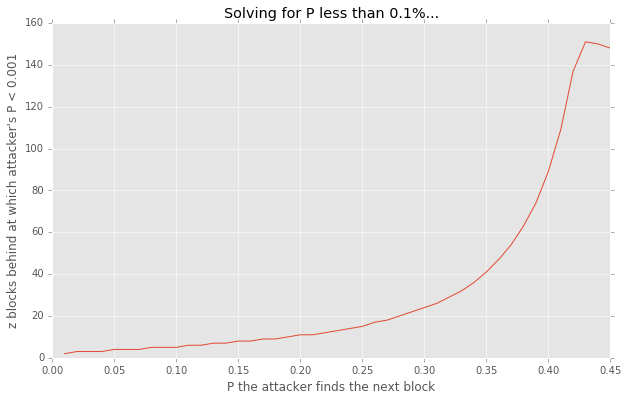

## Quick Python Double-Check and Visualization of Bitcoin Whitepaper



source: [Bitcoin, p.7](https://bitcoin.org/bitcoin.pdf)


```python
import math
import warnings
warnings.filterwarnings('ignore')

def AttackerSuccessProbability(q, z):
    
    p = 1.0 - q
    lambda_ = z * (q/p)
    sum_ = 1.0
    
    k = 0
    poisson = math.exp(-lambda_)
    
    while k <= z:
        
        sum_ -= ((lambda_**k * poisson)/math.factorial(k)) * (1 - (q/p)**(z-k))           
        k += 1
        
    return sum_

AttackerSuccessProbability(.1, 1)
```


    0.20458727394278242


## running some results



source: [Bitcoin, p.8](https://bitcoin.org/bitcoin.pdf)


```python
q = 0.1
print "q=",q

for z in range(11):
    print "z=%d" % z, "\t", "P=%.7f" % AttackerSuccessProbability(q, z)

print ""

q = 0.3
print "q=",q

for z in range(0,51,5):
    print "z=%d" % z, "\t", "P=%.7f" % AttackerSuccessProbability(q, z)
```

    q= 0.1
    z=0 	P=1.0000000
    z=1 	P=0.2045873
    z=2 	P=0.0509779
    z=3 	P=0.0131722
    z=4 	P=0.0034552
    z=5 	P=0.0009137
    z=6 	P=0.0002428
    z=7 	P=0.0000647
    z=8 	P=0.0000173
    z=9 	P=0.0000046
    z=10 	P=0.0000012
    
    q= 0.3
    z=0 	P=1.0000000
    z=5 	P=0.1773523
    z=10 	P=0.0416605
    z=15 	P=0.0101008
    z=20 	P=0.0024804
    z=25 	P=0.0006132
    z=30 	P=0.0001522
    z=35 	P=0.0000379
    z=40 	P=0.0000095
    z=45 	P=0.0000024
    z=50 	P=0.0000006
    

## solving for P < 0.1%



source: [Bitcoin, p.8](https://bitcoin.org/bitcoin.pdf)


```python
import numpy as np


def P_lessthanpoint001(q_beg=0.1, q_end=0.5, q_step=.05, verbose=False):
    
    if verbose==True:
        print "P < 0.001"
    q_s = []
    z_s = []
    
    for q in np.arange(q_beg, q_end, q_step):
        P = 1.0
        z = 0
        while P > 0.001:
            P = AttackerSuccessProbability(q, z)
            z += 1
        if verbose==True:
            
            print "q=%.2f \t z=%d" % (q, z-1)
        else:
            q_s.append(q)
            z_s.append(z-1)
            
    if verbose==False:
        return zip(q_s, z_s)

P_lessthanpoint001()
```


    [(0.10000000000000001, 5),
     (0.15000000000000002, 8),
     (0.20000000000000004, 11),
     (0.25000000000000006, 15),
     (0.30000000000000004, 24),
     (0.35000000000000009, 41),
     (0.40000000000000013, 89),
     (0.45000000000000007, 148)]


```python
attacker_probs = np.array(P_lessthanpoint001(.01, .52, .01))
attacker_probs[-10:]
```


    array([[   0.42,  137.  ],
           [   0.43,  151.  ],
           [   0.44,  150.  ],
           [   0.45,  148.  ],
           [   0.46,  147.  ],
           [   0.47,  146.  ],
           [   0.48,  145.  ],
           [   0.49,  144.  ],
           [   0.5 ,  144.  ],
           [   0.51,  143.  ]])


## graphing the above


```python
import matplotlib.pyplot as plt
import matplotlib
matplotlib.style.use('ggplot')
%matplotlib inline
```


```python
plt.figure(figsize=(10,6))

plt.plot(attacker_probs[:,0], attacker_probs[:,1], '-')
plt.xlim(0.,.45)

plt.title("Solving for P less than 0.1%...")
plt.xlabel("P the attacker finds the next block")
plt.ylabel("z blocks behind at which attacker's P < 0.001")

plt.show()
```





```python

```
