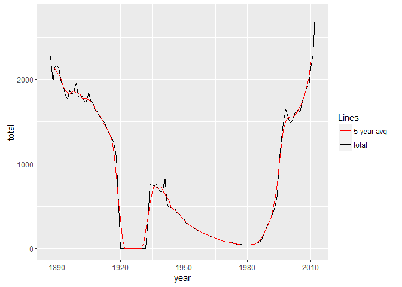
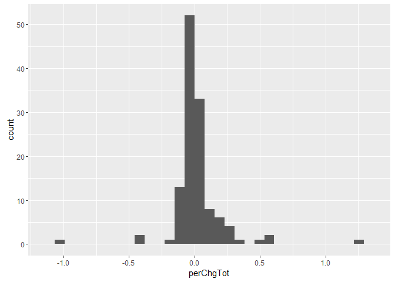
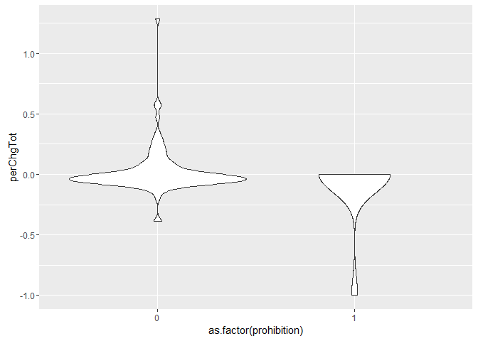
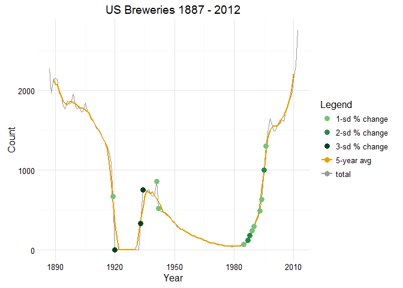

### load
    brw = read.csv('brewers_wholesalers.csv', skip = 1)

### inspect
    names(brw)

    ##  [1] "YEAR"                  "TRADITIONAL.BREWERIES"
    ##  [3] "SPECIALTY.BREWERIES"   "TOTAL.BREWERIES"      
    ##  [5] "BEER.WHOLESALERS"      "X"                    
    ##  [7] "X.1"                   "X.2"                  
    ##  [9] "Year"                  "Count.of.Breweries"

    head(brw)

    ##   YEAR TRADITIONAL.BREWERIES SPECIALTY.BREWERIES TOTAL.BREWERIES
    ## 1 1887                2,269                                2,269
    ## 2 1888                1,968                                1,968
    ## 3 1889                2,144                                2,144
    ## 4 1890                2,156                                2,156
    ## 5 1891                2,138                                2,138
    ## 6 1892                1,967                                1,967
    ##   BEER.WHOLESALERS  X X.1    X.2 Year Count.of.Breweries
    ## 1           3,309  NA  NA Census 1810                150
    ## 2           3,370  NA  NA          NA                 NA
    ## 3           3,603  NA  NA          NA                 NA
    ## 4           3,697  NA  NA          NA                 NA
    ## 5           5,039  NA  NA          NA                 NA
    ## 6           4,969  NA  NA          NA                 NA

    tail(brw)

    ##                                                                                                                                    YEAR
    ## 115                                                                                                                                2012
    ## 116                                                                                                                                    
    ## 117 Brewery Source: Historical Sources, TTB, and Brewing Industry Research Program, The Office of R.S. Weinberg, and the Beer Institute
    ## 118                Wholesaler Source: www.bls.gov - Quarterly Census of Employment and Wages and Historical Sources from Beer Institute
    ## 119                                                                                                                                    
    ## 120                                                                                                                   Table of contents
    ##     TRADITIONAL.BREWERIES SPECIALTY.BREWERIES TOTAL.BREWERIES
    ## 115                    na                  na           2,751
    ## 116                                                          
    ## 117                                                          
    ## 118                                                          
    ## 119                                                          
    ## 120                                                          
    ##     BEER.WHOLESALERS  X X.1 X.2 Year Count.of.Breweries
    ## 115                  NA  NA       NA                 NA
    ## 116                  NA  NA       NA                 NA
    ## 117                  NA  NA       NA                 NA
    ## 118                  NA  NA       NA                 NA
    ## 119                  NA  NA       NA                 NA
    ## 120                  NA  NA       NA                 NA

### subset
    brw = brw[1:115,1:5]
    head(brw)

    ##   YEAR TRADITIONAL.BREWERIES SPECIALTY.BREWERIES TOTAL.BREWERIES
    ## 1 1887                2,269                                2,269
    ## 2 1888                1,968                                1,968
    ## 3 1889                2,144                                2,144
    ## 4 1890                2,156                                2,156
    ## 5 1891                2,138                                2,138
    ## 6 1892                1,967                                1,967
    ##   BEER.WHOLESALERS
    ## 1           3,309 
    ## 2           3,370 
    ## 3           3,603 
    ## 4           3,697 
    ## 5           5,039 
    ## 6           4,969

    colnames(brw) = c('year', 'traditional', 'specialty', 'total', 'wholesalers')
    names(brw)

    ## [1] "year"        "traditional" "specialty"   "total"       "wholesalers"

### convert type/class
    brw = data.frame(sapply(brw, function(x) as.numeric(gsub(',', '', as.character(x)))))

    ## Warning in FUN(X[[i]], ...): NAs introduced by coercion

    ## Warning in FUN(X[[i]], ...): NAs introduced by coercion

    sapply(brw, class)

    ##        year traditional   specialty       total wholesalers 
    ##   "numeric"   "numeric"   "numeric"   "numeric"   "numeric"

    brw[is.na(brw)] <- 0
    summary(brw)

    ##       year       traditional       specialty          total       
    ##  Min.   :1887   Min.   :   0.0   Min.   :   0.0   Min.   :   0.0  
    ##  1st Qu.:1916   1st Qu.:  33.5   1st Qu.:   0.0   1st Qu.: 171.0  
    ##  Median :1955   Median : 210.0   Median :   0.0   Median : 672.0  
    ##  Mean   :1952   Mean   : 620.6   Mean   : 245.6   Mean   : 910.2  
    ##  3rd Qu.:1984   3rd Qu.:1329.0   3rd Qu.:  11.5   3rd Qu.:1647.5  
    ##  Max.   :2012   Max.   :2269.0   Max.   :2111.0   Max.   :2751.0  
    ##   wholesalers   
    ##  Min.   :    0  
    ##  1st Qu.:    0  
    ##  Median : 3609  
    ##  Mean   : 4780  
    ##  3rd Qu.: 8300  
    ##  Max.   :17630

### we know there are gaps in years, PROHIBITION
    qcYear = range(brw$year)[1]:range(brw$year)[2]
    gapYear = qcYear[!(qcYear%in%brw$year)]
    prh = data.frame(matrix(c(gapYear, rep(0, length(gapYear)*4)), length(gapYear), 5))
    colnames(prh) = names(brw)
    prh

    ##    year traditional specialty total wholesalers
    ## 1  1921           0         0     0           0
    ## 2  1922           0         0     0           0
    ## 3  1923           0         0     0           0
    ## 4  1924           0         0     0           0
    ## 5  1925           0         0     0           0
    ## 6  1926           0         0     0           0
    ## 7  1927           0         0     0           0
    ## 8  1928           0         0     0           0
    ## 9  1929           0         0     0           0
    ## 10 1930           0         0     0           0
    ## 11 1931           0         0     0           0

### combine
    brwComp = rbind(brw, prh)
    dim(brwComp)

    ## [1] 126   5

    tail(brwComp)

    ##     year traditional specialty total wholesalers
    ## 121 1926           0         0     0           0
    ## 122 1927           0         0     0           0
    ## 123 1928           0         0     0           0
    ## 124 1929           0         0     0           0
    ## 125 1930           0         0     0           0
    ## 126 1931           0         0     0           0

### order
    brwComp = brwComp[order(brwComp$year),]
    tail(brwComp)

    ##     year traditional specialty total wholesalers
    ## 110 2007          20      1785  1805        2095
    ## 111 2008          20      1876  1896        2099
    ## 112 2009          20      1913  1933        2070
    ## 113 2010          20      2111  2131        2043
    ## 114 2011           0         0  2309        2039
    ## 115 2012           0         0  2751           0

### plot
    library(reshape2)
    library(ggplot2)

    brwLong <- melt(brwComp[, 1:4], id = 'year')
    b <-ggplot(brwLong, aes(year, value, color = variable))
    b + geom_line()

<!-- -->

### 5-year running average
    library(zoo)

    ## 
    ## Attaching package: 'zoo'

    ## The following objects are masked from 'package:base':
    ## 
    ##     as.Date, as.Date.numeric

    temp.zoo <- zoo(brwComp$total, brwComp$year)
    m.av <- rollmean(temp.zoo, 5, fill = list(NA, NULL, NA))
    brwComp$tot.av5 = m.av

    ggplot(brwComp, aes(year, total)) + geom_line() +
        geom_line(aes(year, tot.av5), color = 'red') + 
        labs(title = 'US Breweries 1887 - 2012', x = 'Year', y = 'Count')

    ## Warning: Removed 4 rows containing missing values (geom_path).

<!-- -->

### with legend
    ggplot(brwComp, aes(year)) +
        geom_line(aes(y=total, color='total')) +
        geom_line(aes(y=tot.av5, color='5-year avg')) + 
        scale_color_manual('Lines',
                           values = c('total'='black', '5-year avg'='red'))

    ## Warning: Removed 4 rows containing missing values (geom_path).

<!-- -->

### spot years where brewery % change greatest (1,2 std)
    brwComp$perChgTot = 0
    brwComp[2:126, 'perChgTot'] = brwComp[2:126, 'total']/brwComp[1:125, 'total'] - 1
### replace NA's in prohibition years
    brwComp$perChgTot[is.na(brwComp$perChgTot)] <- 0
### what to use as % change for 1933 to not skew the data? 
### what about ignoring it but highlighting it for special outlier status
    idx_skip = which(brwComp$year == 1933)
    summary(brwComp[-idx_skip, 'perChgTot'])

    ##     Min.  1st Qu.   Median     Mean  3rd Qu.     Max. 
    ## -1.00000 -0.05414 -0.01407  0.01086  0.02083  1.28400

    hist(brwComp[-idx_skip, 'perChgTot'])

### ggplot version, meh
    ggplot(brwComp[-idx_skip,], aes(perChgTot)) +
        geom_histogram()

    ## `stat_bin()` using `bins = 30`. Pick better value with `binwidth`.

<!-- -->

### find years with % change of 1,2,3(?) std
    perChgTot.sd = sd(brwComp[-idx_skip, 'perChgTot'])### kept 1887 (0%), should I have?
    idx_1sdTot = abs(brwComp$perChgTot) > perChgTot.sd
    idx_2sdTot = abs(brwComp$perChgTot) > perChgTot.sd * 2
    idx_3sdTot = abs(brwComp$perChgTot) > perChgTot.sd * 3
    brwSD=brwComp[idx_1sdTot, c('year', 'total')]
    brwSD$sd = '1-sd % change'
    brwSD$sd[brwSD$year %in% brwComp[idx_2sdTot, 'year']] = '2-sd % change'
    brwSD$sd[brwSD$year %in% brwComp[idx_3sdTot, 'year']] = '3-sd % change'

### add prohibition category for further review
    brwComp$prohibition = 0
    prhYears = 1920:1933
    brwComp$prohibition[brwComp$year %in% prhYears] = 1
    ggplot(brwComp, aes(as.factor(prohibition), perChgTot)) +
        geom_violin(scale = 'area')

    ## Warning: Removed 1 rows containing non-finite values (stat_ydensity).

<!-- -->

### plot 1,2,3 std & outlier points (line graph)
    ggplot(brwComp, aes(year)) +
        geom_line(aes(y=total, color='total')) +
        geom_line(aes(y=tot.av5, color='5-year avg'), size=1) + 
        geom_point(data = brwSD, aes(x=year, y=total, color=sd), size=3) +
        scale_color_manual('Legend',
                           values = c('total'='#999999', '5-year avg'='#E69F00',
                                      '1-sd % change'='#74c476', 
                                      '2-sd % change'='#238b45', 
                                      '3-sd % change'='#00441b'),
                           guide = guide_legend(override.aes = list(
                             linetype = c(rep("blank", 3), "solid", "solid")
                             ))) + 
        labs(title = 'US Breweries 1887 - 2012', x = 'Year', y = 'Count') +
        theme_minimal()

    ## Warning: Removed 4 rows containing missing values (geom_path).

<!-- -->

    ggsave('us_breweries_historic.png', width = 16, height = 9)
